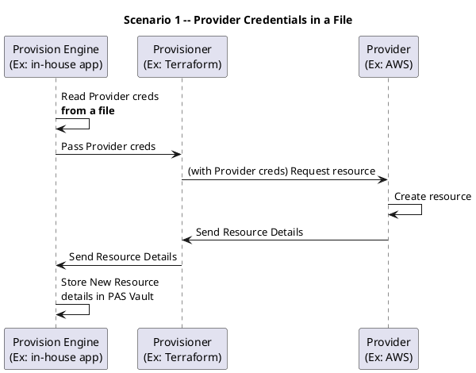
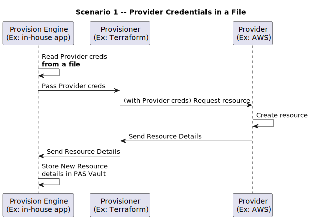
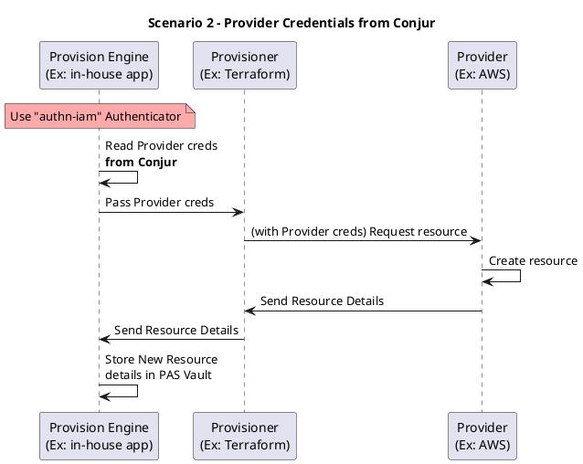
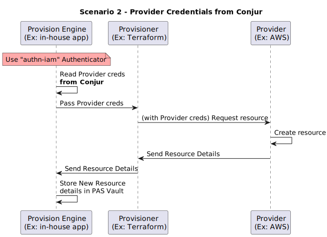
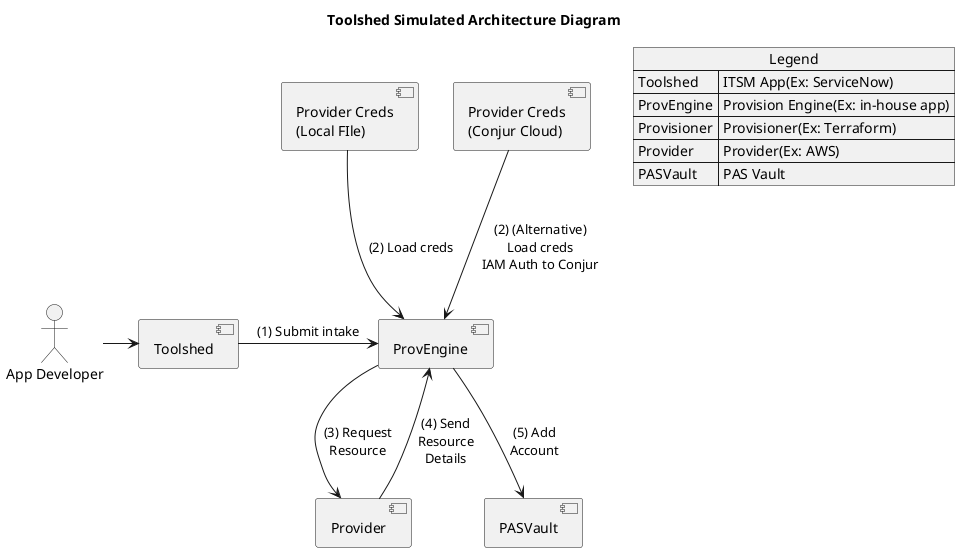
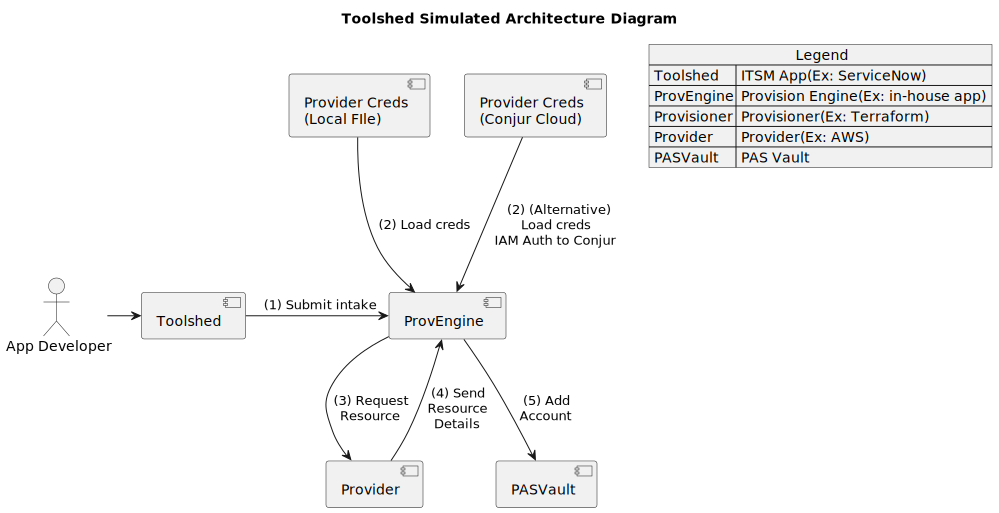
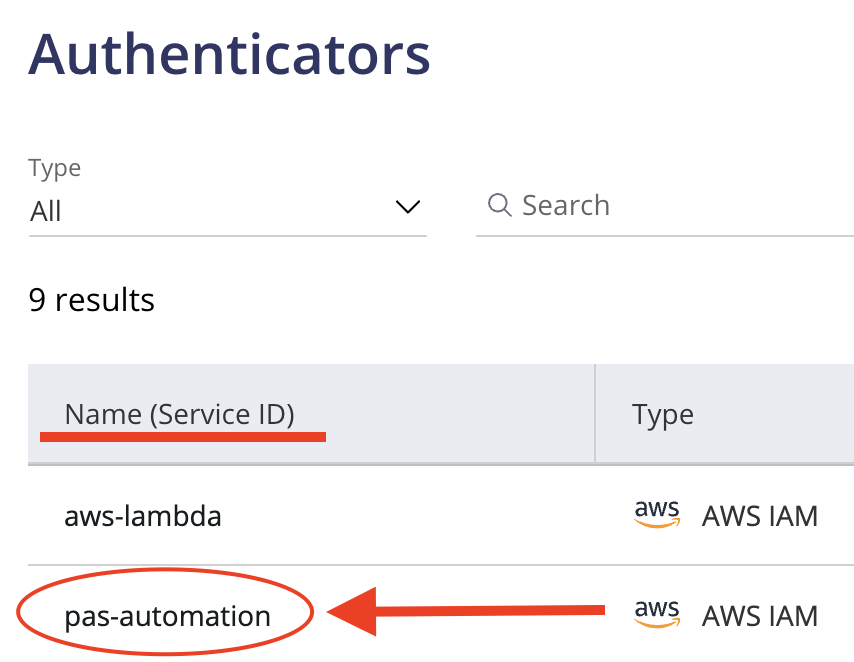
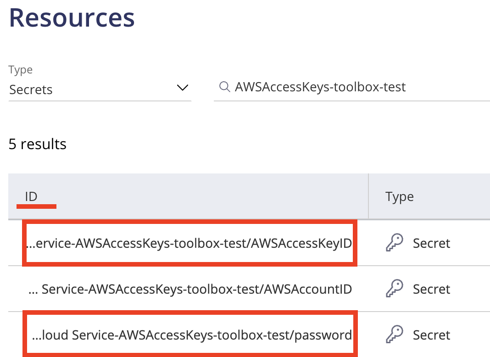

## IT Toolshed

**NOTE: "IT Toolshed" is intended as a front-end for DEMO purposes only.**

## Summary

There are 2 User scenarios that are modeled in this demo.  This accelerator illustrates how to setup for each of these scenarios.

### Scenario 1 -- Provider Credentials in a File

Provider credentials have permissions to create, modify and delete resources at the provider.  For this demo, AWS is the provider.  This scenario is used to contrast with Scenario 2 so that one can see the differences between the two.

<!--

-->


### Scenario 2 -- Provider Credentials from Conjur

This scenario demonstrates the separation of concerns by using 2 sets of AWS credentials, one set of credentials is used to authenticate to Conjur Cloud, and the other set of credentials is used to provision resources in AWS.

<!--

-->


There are 2 apps that comprise this demo, the "ITSM App" and the "Provision Engine."   The "ITSM App" provides an intake form for an application developer to make a request for a resource.  The "Provision Engine" will accept the request, call the Provider to request resources to be created, and then store the new resource information in the PAS Vault safe.

Under `cmd/toolshed` is the app that provides a web server app to provide the intake form and forward the request to the provision engine.

Under `cmd/provengine` is the app that will either use the Provider creds from a file (Scenario 1), or, it will call on Conjur Cloud and fetch the provider credentials from there.

The following reference diagram illustrates a high-level process flow whereby a resource is requested, provisioned, and access details are returned to the requestor.  

## Prerequisites

To use this solution accelerator, you will need access to an AWS account, CyberArk PAS Vault, and CyberArk Conjur Cloud with sync enabled.

### For CyberArk PAS Vault

1. Create a safe for storing the Provider credentials.  
2. Create a safe for storing the new resource's account information.  This separate safe is to keep a separation of concerns between the accounts.

### For AWS

1. Create an AWS User with permissions to Create Tags, Create Key Pairs, and Create EC2 instances.  These credentials will be used to provision a new keypair and new ec2 instance.
2. Store these credentials in your PAS Vault safe

### For Conjur Cloud

1. Create an AWS User with permissions associated to Conjur for "authn-iam" connector
   * Create Access Key and Secret for this user
   * Store these credentials in your PAS Vault safe
2. Install Conjur IAM Authenticator
3. Enable PAS Vault sync

## Toolshed Simulated Architecture

This diagram illustrates how the toolshed app and the provengine app work together.

<!--

-->


## Demo Setup and Usage

IMPORTANT - Please read and configure the resources as specified in the Prerequisites section before proceding with the demo.

This demo can be run from linux/mac, or from an EC2 linux instance.

### Steps to run through the demo

1. git clone toolshed
2. cd toolshed
3. cd into the bin directory
4. Make copies of the pasconfig-example.toml, awsconfig-example.toml, and conjurconfig-example.toml files (See the next section "Configuration Files" for detailed explanation of each field.)
   1. cp pasconfig-example.toml pasconfig.toml
   2. cp awsconfig-example.toml awsconfig.toml
   3. cp conjurconfig-example.toml conjurconfig.toml
5. Edit the config files to configure with the info from the Prerequisites
6. make run
7. open a browser to <http://localhost:8080/>
8. In the browser fill in the toolshed intake form
9. Open AWS console to view the new EC2 instance
10. Open PAS Vault to view the new account for the new EC2 instance details

### Configuration Files

This section will describe the contents of the fields for each of the configuration files.

#### PAS Config File

Copy the example config file, `./cmd/provengine/pasconfig-example.toml` with name `./cmd/provengine/pasconfig.toml`

Here is what the example looks like.

```toml
[pasvault]

baseurl = "https://mypasserver.example.com"
safename = "safe1"

# User must be able to create account
user = 'MYUSER' 
pass = 'MYPASSWORD'
```

| Field Name | Description | Required For Scenario 1 | Required For Scenario 2 |
| -- | -- | -- | -- |
| baseurl | This is the base url to your PAS instance; no trailing slash | YES | YES |
| safename | This is the name of the PAS Vault safe that you created as part of the pre-requisites.  NOTE: This is where the NEW EC2 creds will be stored. | YES | YES |
| user | This is the PAS Vault user name that will be used to get a session token; NOTE: must have permission to create an account in the safe. | YES | YES |
| pass | This is the PAS Vault user's password. | YES | YES |

#### AWS Config File

Copy the example config file, `./cmd/provengine/awsconfig-example.toml` with name `./cmd/provengine/awsconfig.toml`

**NOTE: For "Scenario 1"** -- Fill out all of these fields, and leave Conjur config file `empty`.

**NOTE: For "Scenario 2"** -- ONLY fill out the `region` field, and completely fill out the conjur config.

Here is what the example looks like.

```toml
[awsprovider]

# REQUIRED
# Set this to your Target Region where you will provision your EC2 instance
region = "us-west-2"

# OPTIONAL
# Leave these blank if using Conjur
accesskey = ""
accesssecret = ""
```

| Field Name | Description | Required For Scenario 1 | Required For Scenario 2 |
| -- | -- | -- | -- |
| region | AWS Region where the NEW EC2 instance will be provisioned | YES | YES |
| accesskey | AWS User's access key | YES | NO |
| accesssecret | AWS User's access secret | YES | NO |

#### Conjur Config File

Copy the example config file, `./cmd/provengine/conjurconfig-example.toml` with name `./cmd/provengine/conjurconfig.toml`

**NOTE: For "Scenario 1"** -- Leave Conjur config file `empty`.

**NOTE: For "Scenario 2"** -- Completely fill out the Conjur config file.

Here is what the example looks like.

```toml
[conjur]
apiurl              = "https://conjurserver.example.com/api"
account             = "conjur"

# Example: "host/conjur/authn-iam/MYAPPNAME/applications/abc123/toolshed-user"
identity            = ""

# use "authn-iam/" as the base
authenticator       = "authn-iam/APPNAME"

# Conjur Region -- used for authn-iam (Region where Conjur is running)
awsregion           = "us-east-1"

# Conjur IAM auth creds -- AWS key/secret used for authn-iam (not the same as the provisioner creds)
awsaccesskey        = ""
awsaccesssecret     = ""

# Conjur path to AWS key/secret used to provision resources
awsprovideraccesskeypath    = "data/vault/PATH/TO/THE/AWSProviderAccessKey"
awsprovideraccesssecretpath = "data/vault/PATH/TO/THE/AWSProviderAccessSecret"
```

| Field Name | Description | Required For Scenario 1 | Required For Scenario 2 |
| -- | -- | -- | -- |
| apiurl                      | Conjur API endpoint | NO | YES |
| account  | Conjur Account | NO | YES |
| identity  | Conjur Identity associated to the user | NO | YES |
| authenticator  | Conjur Authenticator, prefix with "authn-iam/" and append the Authenticator "Service ID"  | NO | YES |
| awsregion  | Conjur AWS Region -- which AWS region is running Conjur (this can be different from the provider AWS region) | NO | YES |
| awsaccesskey  | Conjur AWS User's access key | NO | YES |
| awsaccesssecret | Conjur AWS User's access secret | NO | YES |
| awsprovideraccesskeypath  | Conjur Resources, Secrets "ID" where the Provider AWS Access Key is stored (see note below) | NO | YES |
| awsprovideraccesssecretpath | Conjur Resources, Secrets "ID" where the Provider AWS Access Secret is stored (see note below) | NO | YES |

* **Conjur Authenticator "Service ID"**


* **Conjur AWS Provider Access Key and Secret Path**


## References

* [PAS Vault Add Account](https://docs.cyberark.com/PAS/Latest/en/Content/WebServices/Add%20Account%20v10.htm)
* [PAS Vault REST API doc](https://docs.cyberark.com/Product-Doc/OnlineHelp/PAS/Latest/en/Content/WebServices/Implementing%20Privileged%20Account%20Security%20Web%20Services%20.htm?tocpath=Developer%7CREST%20APIs%7C_____0)
