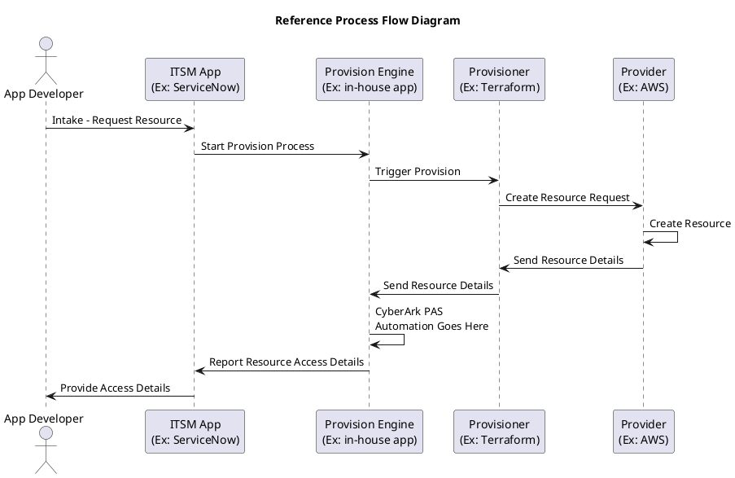
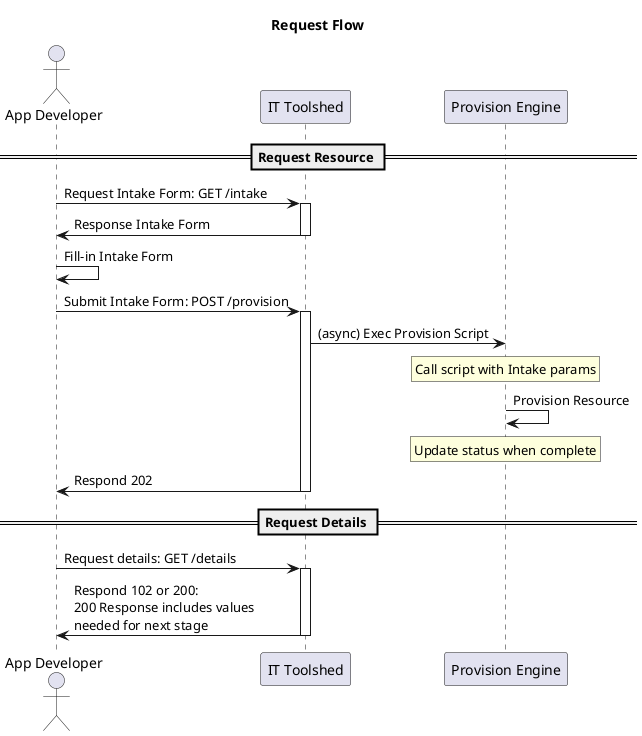
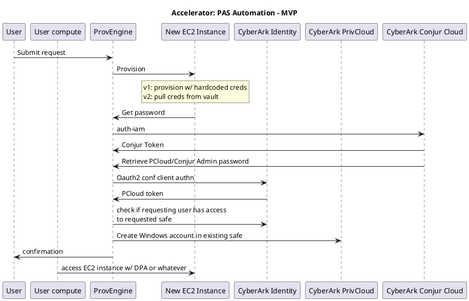

## IT Toolshed

## Summary

**NOTE: "IT Toolshed" is intended as a front-end for DEMO purposes only.**

There are 2 components, the "ITSM App" and the "Provision Engine."   The "ITSM App" provides an intake form for an application developer to make a request for a resource, send the request to the provision engine, and report back to the user the access details.

The primary purpose of IT Toolshed is to serve as a facade for use in demos.  E.g. present an intake form and simulate passing the params to a backend provision engine.

The following reference diagram illustrates a high-level process flow whereby a resource is requested, provisioned, and access details are returned to the requestor.  The details of the "CyberArk PAS Automation Goes Here" are discussed below and illustrate how to onboard credentials into CyberArk PAS.



### IT Toolshed Request Flow



<!--

-->


## "CyberArk PAS Automation Goes Here"

### Meta

#### Document Toolchain

* [PlantUML](https://plantuml.com/starting)
* VSCode Extensions used to produce this document
  * [PlantUML](https://marketplace.visualstudio.com/items?itemName=jebbs.plantuml)
  * [Markdown Extension Pack](https://marketplace.visualstudio.com/items?itemName=bat67.markdown-extension-pack)
  * [Markdown Plantuml Preview](https://marketplace.visualstudio.com/items?itemName=myml.vscode-markdown-plantuml-preview)
* Emacs
  * Install `markdown-it`, `markdown-it-cli` and the plugins for `plantuml-ex` and `meta-header`

    ```bash
    npm install markdown-it --save
    npm install markdown-it-cli --save
    npm install markdown-it-meta-header --save
    npm install markdown-it-plantuml-ex --save
    ```

  * Recommend to download the latest plantuml.jar and replace the jar in `plantuml-ex`

    ```bash
    # use the latest plantuml.jar
    curl -sLJO https://github.com/plantuml/plantuml/releases/download/v1.2023.9/plantuml.jar -o plantuml.jar
    mv plantuml.jar ./node_modules/markdown-it-plantuml-ex/lib/plantuml.jar
    ```

  * Add this to your `.emacs.d/init.el`

    ```elisp
    ;; https://jblevins.org/projects/markdown-mode/
    ;; Using npm "markdown-it" with "meta-header" and "plantuml-ex" plugins.
    ;; Steps to install it:
    ;;  npm install markdown-it --save
    ;;  npm install markdown-it-cli --save
    ;;  npm install markdown-it-meta-header --save
    ;;  npm install markdown-it-plantuml-ex --save
    ;;  # use the latest plantuml.jar
    ;;  curl -sLJO https://github.com/plantuml/plantuml/releases/download/v1.2023.9/plantuml.jar -o plantuml.jar
    ;;  mv plantuml.jar ./node_modules/markdown-it-plantuml-ex/lib/plantuml.jar
    (use-package markdown-mode
      :ensure t
      :mode ("README\\.md\\'" . gfm-mode)
      :custom
      (markdown-command "npx markdown-it-cli")
      (markdown-command-needs-filename t)
      :config
      ;; update preview buffer when md file is saved
      (add-hook 'before-save-hook 'markdown-live-preview-re-export))
    ```
